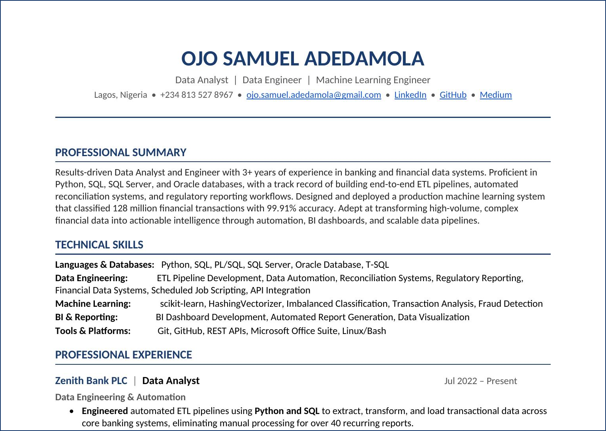

# Samuel Ojo

**Financial Data Analyst | Data Engineer | Machine Learning**

I work on financial data systems, automation pipelines, and machine learning models for transaction analysis.

---

📄 [Download Resume (PDF)](./Samuel_Ojo_Data_Engineer_ML_Resume.pdf)

---

## Key Projects

- **[ZIMS-ML-STREAMING](https://github.com/samdamz18/zims-ml-streaming)** — ML classification pipeline for financial transactions (128M transactions, 99.91% accuracy, Macro-F1 0.93) — *Built at Zenith Bank PLC*
- **[Fraud Detection ML](https://github.com/samdamz18/fraud_detection)** — Machine learning model for financial transaction fraud detection, addressing extreme class imbalance in real-world datasets

---

## Articles

- 📝 [Classifying 128 Million Financial Transactions](https://medium.com/@sammzy/classifying-128-million-financial-transactions-63ba864c0c9e) — Architecture and engineering decisions behind ZIMS-ML-STREAMING
- 📝 [Why Your Fraud Detection System Probably Catches Almost Nothing](https://medium.com/@sammzy/why-your-fraud-detection-system-probably-catches-almost-nothing-8a9da0a8d928) — Why standard fraud detection models fail in practice and how to fix them
- 📝 [The Fraud Signal Was Never Where I Thought It Would Be](https://medium.com/@sammzy/the-fraud-signal-was-never-where-i-thought-it-would-be-8b128f057b95) — A deep dive into feature effectiveness in fraud detection, showing why velocity-based signals fail and how behavioural and relational features drive stable performance under temporal validation
---

## Repositories

- 🔗 [zims-ml-streaming](https://github.com/samdamz18/zims-ml-streaming) — Production ML pipeline for large-scale financial transaction classification
- 🔗 [fraud_detection](https://github.com/samdamz18/fraud_detection) — Fraud detection on imbalanced financial transaction data
- 🔗 [ieee-cis-fraud-signal-analysis](https://github.com/samdamz18/ieee-cis-fraud-signal-analysis) — End-to-end fraud detection analysis on IEEE-CIS dataset, comparing behavioural, velocity, and relational features with AUPRC evaluation and temporal validation to identify stable real-world signals
- 🔗 [GitHub Profile](https://github.com/samdamz18) — All public repositories

---

## Connect

- 💼 [LinkedIn](https://linkedin.com/in/samuel-adedamola-ojo)
- ✍️ [Medium](https://medium.com/@sammzy)
- 📧 ojo.samuel.adedamola@gmail.com
